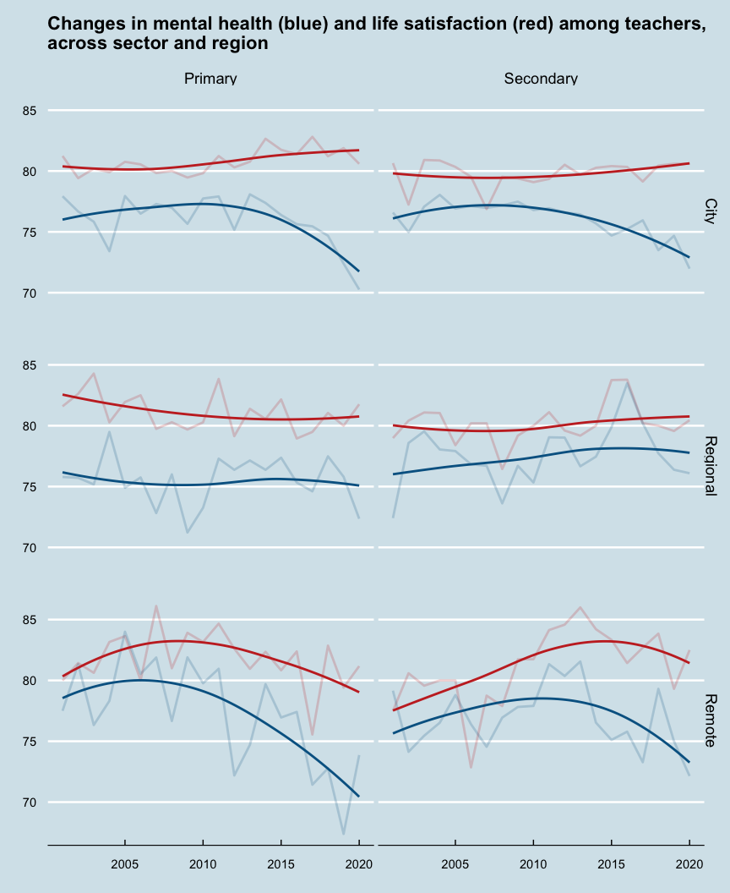
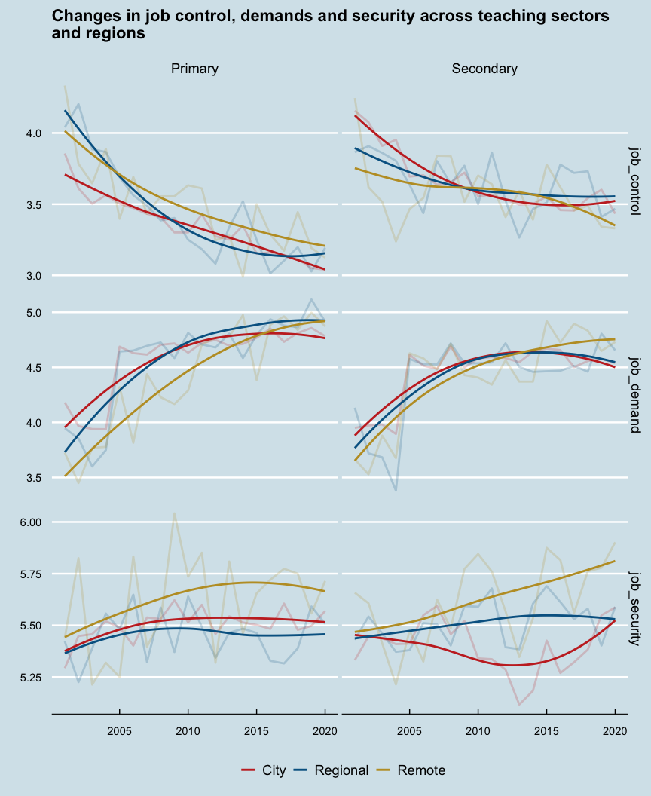
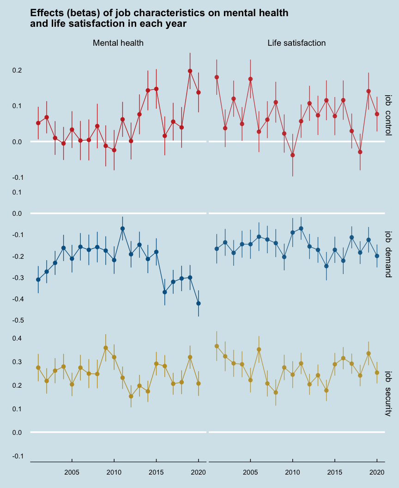
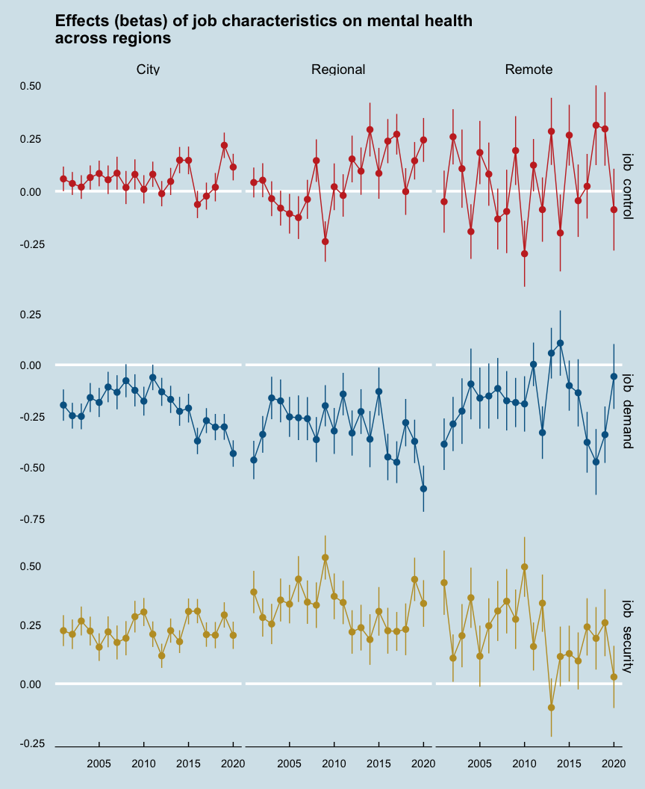
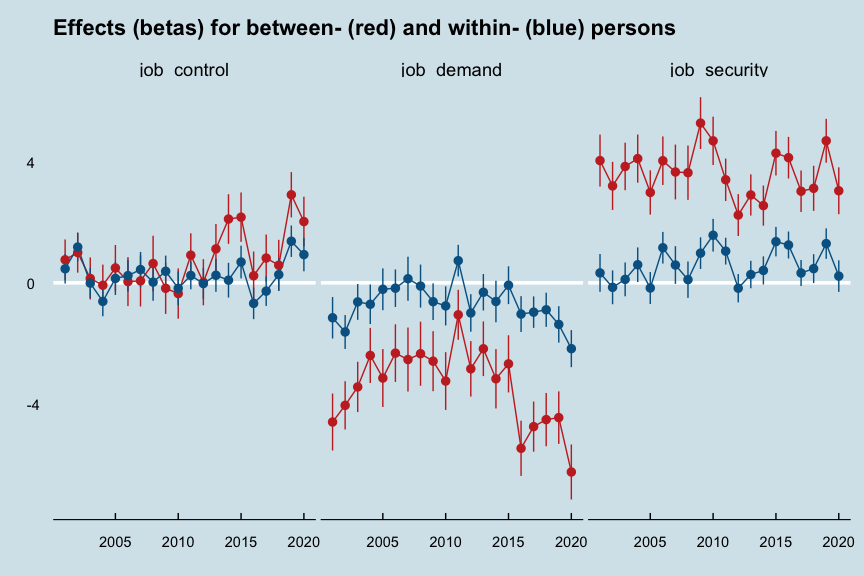

modern-teachers
================

## Project layout

\|– README this file  
\|  
\|– data/  
\|   *data required for project (inputs)*  
\|  
\|– docs/  
\|   *written/text generated by project (output)*  
\|  
\|– figures/  
\|   *plots and figures generated by project (output)*  
\|  
\|– literature/  
\|   *background research for project (input)*  
\|  
\|– results/  
\|   *data generated by project (output)*  
\|  
\|– src/  
\|   *scripts and code to generate outputs (results/figures/docs)*

  

## Survey results

##### Figure 1. Mental health has declined among teachers in city and remote regions

<!-- -->

 

Average levels of mental health have declined among teachers in city and
remote regions, especially recently. Life satisfaction appears to be
relatively steady.

  

##### Figure 2. Job strain has increased across sectors and regions

<!-- -->

 

Job strain increases with high demand and low control, and demand has
been increasing while control decreasing for teachers across sectors and
regions over the last 20 years. That suggests that increasing job strain
is widespread.

  

## Model results

Determining the role of job strain in the changes to mental health
requires estimating the effect of each job characteristic on mental
health in a regression model (e.g.,
`mental_health ~ 1 + job_control + job_demand + job_security`). Linear
models of mental health were estimated for each year, and the size and
the direction of the coefficients (betas) for each job characteristic
indicated their importance for differences in mental health each year.

  

##### Figure 3. Job demands (and control) are increasingly important for mental health

<!-- -->

 

Mental health seems to be increasingly dependent on job control and job
demands in the last five years, as the beta estimates get further from
zero between 2015 to 2020. The dependence of life satisfaction on job
characteristics has remained relatively steady over the same time
period.

  

##### Figure 4. The importance of job demands (and control) has increased in cities and regions

<!-- -->

  

##### Figure 5. Job demands are more important for differences in mental health between people and over time

<!-- -->

 

Job demands and job control have become more important for explaining
differences in mental health between people each year, as well as
changes in mental health over time for each person.

  

In general, the model results show that job demands and job control are
increasingly impacting the mental health of teachers in cities and
regions of Australia.

  

## Tables

##### Table 1. Change in teacher demographics between 2001 and 2020

 

Both Primary and Secondary teachers had significant changes in education
levels and income between 2001 and 2020. Secondary teachers also had
significant changes in regional distribution.

  

##### Table 2. Primary & Secondary teacher differences in 2001 & 2020

 

Primary school teachers tended to be more female and less educated than
secondary teachers. This was consistent in 2001 and 2020.

  

##### Table 3. Regional differences in 2020

 

Primary school teachers in the city are morely likely to have a
postgraduate degree than regional or remote primary teachers in 2020. No
other differences were significant.

  

## Psychosocial characteristics of work

#### Job demands & complexity

| code      | description                                                 | waves     |
|-----------|-------------------------------------------------------------|-----------|
| `jomms`   | My job is more stressful than I had ever imagined           | all waves |
| `jompi`   | I fear that the amount of stress in my job will make me ill | all waves |
| `jomcd`   | My job is complex and difficult                             | all waves |
| `jomns`   | My job often required me to learn new skills                | all waves |
| `jomus`   | I use my skills in current job                              | all waves |
| `jomini`  | My job requires me to take initiative                       | 5:20      |
| `jomfast` | I have to work fast in my job                               | 5:20      |
| `jomwi`   | I have to work very intensely in my job                     | 5:20      |
| `jomtime` | I don’t have enough time to do everything in my job         | 5:20      |

#### Job control

| code      | description                                                   | waves     |
|-----------|---------------------------------------------------------------|-----------|
| `jomfd`   | I have freedom to decide how I do my own work                 | all waves |
| `jomls`   | I have a lot of say about what happens in my job              | all waves |
| `jomfw`   | I have freedom to decide when I do my work                    | all waves |
| `jomdw`   | I have a lot of choice in deciding what I do at work          | 5:20      |
| `jomflex` | My working times can be flexible                              | 5:20      |
| `jombrk`  | I can decide when to take a break                             | 5:20      |
| `jomrpt`  | My job requires me to do the same things over and over again  | 5:20      |
| `jomvar`  | My job provides me with a variety of interesting things to do | 5:20      |

#### Job security

| code     | description                                             | waves     |
|----------|---------------------------------------------------------|-----------|
| `jompf`  | I get paid fairly for the things I do in my job         | all waves |
| `jomsf`  | I have a secure future in my job                        | all waves |
| `jomcsb` | Company I work for will still be in business in 5 years | all waves |
| `jomwf`  | I worry about the future of my job                      | all waves |
